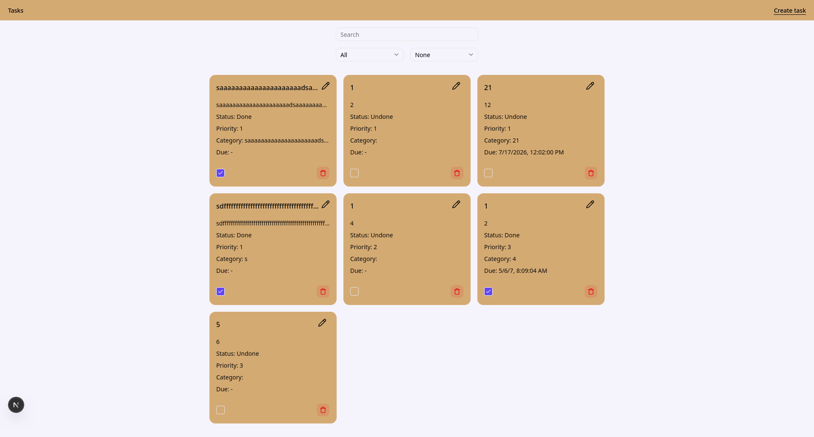

# To-Do



# Table of Contents

- [To-Do](#to-do)
- [Table of Contents](#table-of-contents)
- [Description](#description)
- [Setup](#setup)
    - [Backend](#backend)
    - [Frontend](#frontend)
  - [Tests:](#tests)
- [License](#license)

# Description

Full-stack task app on fastapi and next.js.

# Setup

Clone repository
```bash
git clone https://github.com/Vasya-556/to-do.git
```

### Backend

1. Create virtual enviroment for python and install dependencies
```bash
python -m venv env
# On Windows
env\Scripts\activate
# On macOS/Linux
source env/bin/activate
cd backend
pip install -r requirements.txt
```

2. Create .env in backend/ following .env.example

3. Run server
```bash
uvicorn core.main:core --reload
```

### Frontend

1. Install dependencies
```bash
cd frontend
npm install
```

2. Run server
```bash
npm run dev
```

## Tests:

- Backend
```bash
cd backend
pytest
```

- Frontend
```bash
cd frontend
npx playwright test --project=chromium --headed 
```

# License

[MIT](LICENSE)